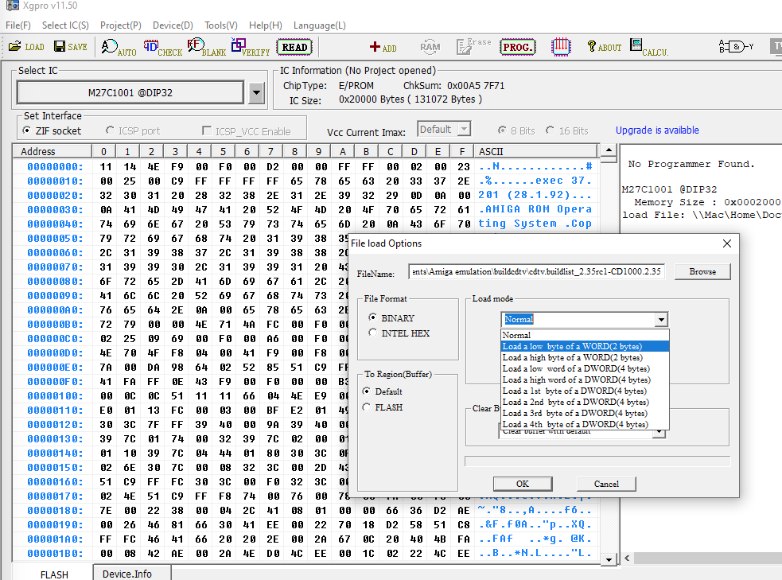

# CDTV OS 2.35 - FAQ

### Is this an official CDTV OS ROM release?
No. This is a "custom" ROM. It is not affiliated with, nor is it endorsed by the Amiga Corporation, which is the current owner of the Amiga's IP (and hence also CDTV), nor is it affiliated with or endorsed by Hyperion BVBA (a licensee).

### Is this another ROM hack? 
Most definitely not. A lot of time has gone into reverse engineering the original binary ROM code for this project. This was necessary because the original CDTV OS firmware/software is not open source. The result of the reverse engineering process is 100% assembler source code that can be built into a byte-by-byte exact binary copy of the original ROM modules on modern day machines using open source software. The source code can then be used to easily update, bugfix or otherwise improve these modules. This allows further development of the CDTV OS without needing access to the original Commodore source code anymore.

### Will you share the source code?
I would love to put the source code of the reverse engineered ROM modules on my GitHub page, but I cannot. Although the reverse engineered source code, the bugfixes, modifications, and new features that went into CDTV OS 2.35 are all my own work, the resulting ROM image is still a derivative of the original Commodore ROM, and as such the copyright still belongs to the current owner, Amiga Corporation. I cannot distribute my modified ROM images without their permission.

### Why can't I download this ROM image anywhere?
See the answer to the previous question.

### What is CDTV OS exactly?
CDTV OS is the name for all the functionality provided by the resident modules inside the CDTV OS ROM, a.k.a. Extended ROM. They are required to make a CDTV player function. It contains drivers and libraries for the CD-ROM drive, the CDTV memory cards, ISO9660 filesystem support and user interface stuff like the CD-Audio playback application, the Preferences screen, the CD+G playback application and more. It integrates with and depends on several exisiting Amiga operating system modules in the Kickstart ROM. It is not a full operating system in the traditional sense. A crude but apt modern day comparison is Horizon OS on the Nintendo Switch or the PS5's Orbis OS, it's just harder to update because you need to replace two ROM chips.

### Was CDTV OS ever used as a term or are you just making this up?
The term CDTV OS has been used by:

-  Carl Sassenrath (creator of the Amiga Exec kernel and many CDTV OS components like cdtv.device, bookmark/cardmark.device, cdfs.library, cdg.library and cdstrap): _"My original CDTV development board (1990) that I used to build and test the CDTV OS, drivers, libs, etc"_ . Source: http://www.rebol.com/article/0491.html
- Reichart von Wolfsheild, another member of the CDTV project team (playerprefs.library, debox.library): _"The core team that made the CDTV OS were Carl Sassenrath (who now is working with Roku), Jim Sachs, Will Ware, Leo Schwab, and myself."_  Source: https://www.gregdonner.org/workbench/wb_cdtv.html: 
- Additionally, the official CDTV Developer Reference manual (1992) from Commodore uses the same term in paragraph 3.3.3: _"There is a bug in the V1.3 graphics.library which can cause the CDTV unit to come up in NTSC mode even though it should come up in PAL mode. There is an update of the CDTV OS ROM which fixes this problem."_ Source: https://archive.org/details/CDTV_Developer_Reference_Manual/page/n253/mode/2up?q=%22cdtv+os%22

### Is CDTV OS ROM the same as CDTV Extended ROM?
Yes, in this specific context the two terms are interchangeable. I prefer using the term CDTV OS ROM, because it is a more specific description of the product, while the term "Extended ROM" is more of a generic description referring to any resident modules or code that might be present in the extended Kickstart ROM address range. Some people also refer to it as a "Boot ROM", which is a misnomer in my opinion. The CDTV Bootstrap module (cdstrap) takes up just a tiny percentage of the ROM, so it's like calling a car a steering wheel.

On the other hand, Commodore has been inconsistent as hell when it comes to naming and branding their software and hardware over the years both internally and publically, so use whatever term makes you feel warm on the inside.

### How did you reverse engineer the CDTV OS ROM?
I used amitools to determine the memory locations of the various resident modules in the official 2.30 ROM. I did not split the modules into loadsegable format, but loaded them straight into Ghidra with the absolute jump addresses still intact (Ghidra seemed to be much better in disassembling the modules this way than using the Amiga hunk format). After Ghidra did its first pass of disassembly I started manually going through the code disassembling the parts that were unidentified (which was usually a lot) and fixing parts that were incorrectly disassembled. It helps to know the common data structures of the Amiga OS (resident modules, devices, libraries, lists etc) and how to recognize library calls, but also to know hardware register addresses of the Amiga chipset and CDTV specific hardware like the DMAC and TriPort chips.

After most of a ROM resident module was disassembled I would dump it out as a text file. Unfortunately Ghidra doesn't export valid 68k assembly so I used a whole bunch of regexes to whip the result into shape. Once I got the module to build in vasm without errors I would start the next stage which is to do a binary diff between my build artifact and the one from the ROM and fixing the differences one by one until I ended up with assembler source that built into a 100% identical binary. I would typically just use xxd to convert the original and new binaries into text and then load the results side by side into vimdiff for analysis/comparison.

This process was repeated for every resident module that needed reverse engineering (cdtv.device, bookmark.device, cdstrap, and cdfs.library). I also partially disassembled cdg.library, but ultimately decided the needed patch was simple enough to just patch the original resident module binary directly without needing to fully resource it. I might finish the resourcing of cdg.library at a later date.

### Why did you make this ROM?
I thought it would be a nice challenge and I'd be helping out many fellow CDTV users. The CDTV platform seemed like an almost forgotten corner of the Amiga universe sorely in need of updates. Some more in-depth explanation about why I did this can be found on [this](https://cdtvland.com/2021/09/19/cdtv-os-2-35-technical-and-legal-stuff/) page.

### Why exactly does the CD-ROM drive stop working on all other ROMs except yours when you install a 68030 accelerator and/or 32-bit Fast RAM in a CDTV player?
That's an oddly specific question, glad you asked! There are three problems that were solved in CDTV OS 2.35: the first is that the DMAC chip (the DMA controller) has a 24-bit addressing limit. The CD-ROM device driver (cdtv.device), the ISO9660 filesystem library (cdfs.library), the CD+G playback app (cdg.library) and the CDTV Bootstrap code (cdstrap) do memory allocations without taking this into account. This works fine as long as there is no 32-bit Fast RAM present on the system. However, as soon as you add 32-bit Fast RAM this falls flat on its face, because then memory allocations take place in 32-bit RAM and the DMAC is instructed to DMA into those unreachable buffers. I fixed this by ensuring that all memory allocations in the CDTV OS ROM that are used for DMAing CD-ROM data take place inside the 24-bit addressing limit.

The second problem has to do with the TriPort (6525) chip and the 68030. The 6525 is used for various functions inside the CDTV player like setting the DAC attenuation, delivering subcode data from CD-ROM, putting the CD-ROM drive in and out of command mode and more. Although every CPU, whether it's a 68000, 68020 or 68030 is "paced" by the system/expansion bus on the CDTV, it seems that the 68030 is still just a tad too fast for the 6525 chip as tests have determined that two consecutive writes to this chip's registers will often fail on a 68030, while working fine on a 68000, 68010 or 68020. I don't know why this is, but I suspect it has to do with the more advanced pipelining of the 68030 compared to older generations of the 680x0 series. This seems to be enough of a speed increase to push it over the write cycle timing limits of the 6525, i.e. the ROM code is not holding the control lines to the TriPort chip in a specific state long enough before changing it again to something else, when executed on a 68030. As a result some commands, like putting the CD-ROM hardware in command mode, will fail from time to time which subsequently causes DMA timeouts on the system (cdfs.library will retry failed DMA transfers up to 32 times, so in the end the transfer might succeed, but I/O is painfully slow and CDXL streaming is broken). I fixed this problem by inserting a NOP between two consecutive writes to 6525 registers in cdtv.device, wherever that occurs (once for putting the drive in command mode and once in the DAC attenuation routine). This resulted in 100% success rate in all tests and has been exhaustively tested.

The third problem is CPU caching of the DMAC Autoconfig I/O address range by the 68030. Caching I/O registers is fundamentally bad practice and can lead to unexpected results. In my tests the TF536 seemed to be unaffected, but the Viper 530 definitely had problems and also exhibited some weird corruption of data in the Extended ROM address range (F00000-F7FFFF) when CPU caching was enabled. Unfortunately the Zorro II expansion bus does not have cache inhibit lines so I fixed this problem by creating a [resident module](https://github.com/C4ptFuture/cdtv-mmu) in the CDTV 2.35 OS ROM (with a high priority so that it gets initialized very early in the system startup), that uses the 68030 MMU to disable CPU caching using one of its Transparent Translation registers. This coarse method of cache inhibiting is guaranteed to give a working CD-ROM, but it inhibits caching for the whole 24-bit address range. However, power users can still use more fine grained tools like mmu.library to disable caching of the Zorro II Autoconfig I/O address range and any other ranges that might need cache inhibit. Please consult the mmu.library documentation on how to cache inhibit specific areas of memory.

### You say that the ROM uses the 68030 MMU to do cache-inhibit, but SysInfo and any other tool says the MMU unused. What gives?
Cache inhibit in CDTV OS 2.35 is configured using the MMU's TTx registers. The MMU does not need any active translation tables to be configured for the Transparent Translation registers to function. 

### Does CDTV OS 2.35 also support 68040 and 68060 accelerators?
I don't know. I did not have access to 68040 or 68060 based accelerators during the development of CDTV OS 2.35, nor were these accelerators targeted during development.

### Does CDTV OS 2.35 work with PiStorm?
PiStorm currently does not implement bus arbitration. This means that 
CD-ROM and SCSI device access does not work on CDTV. This is a hardware issue with the PiStorm itself that is unrelated to CDTV OS 2.35. I understand that work is underway to implement bus arbitration, but please consult the PiStorm project for details.

### Which 68030 based accelerators can be used in a CDTV player?
CDTV OS 2.35 has succesfully been tested with the TerribleFire TF536 and M-Tec/E-Matrix Viper 530 accelerator boards, although it is very likely that any 68030 based accelerator will work. TF536 users are advised to [update](https://www.exxoshost.co.uk/forum/viewtopic.php?f=76&t=3542&start=30#p70123) their TF536 firmware, though.

### Why do I need to update my TF536 firmware?
It is not a requirement per se, but TF536 users _are_ advised to update their cards with a CDTV specific build of the [firmware](https://www.exxoshost.co.uk/forum/viewtopic.php?f=76&t=3542&start=30#p70123), which removes a piece of boot code that overlaps with the first 16K of the CDTV Extended ROM space, which is where the CDTV OS ROM code lives. I have changed the order of the resident modules in CDTV OS 2.35 to work around this issue so that all vital modules fall outside of this block of memory. This will make CDTV OS 2.35 function just fine even if you don't update your TF536 firmware. However, this comes with a small trade off, because the onboard CDTV specific exec.library and A590/XT/SCSI handler will be unavailable. As a result there is no SCSI HDD support and the CDTV memory card range (E00000-E7FFFF) is not scanned for resident modules on system startup. This is mitigated by the fact that the TF536 already offers IDE-based HDD and most users are very unlikely to use resident modules on memory cards, but just be aware those limitations exist if you do not update the TF536 firmware.

### What Kickstart ROM versions are compatible with CDTV OS 2.35?
CDTV OS 2.35 works with any Kickstart ROM from version from 1.3 and up. That means it also works fine with the newest Hyperion Kickstart ROMs (tested up to Kickstart 3.2.1).

### Does the CDTV OS 2.35 ROM also work on my A570 or A690?
Yes, but right now only the CDTV OS 2.35 ROM update for the CDTV player (CD1000) is available. The update for the A570 and A690 will be available at a later date (projected release date: Q1 2022).

_Do not use the CD1000 ROM in an A570, because that can potentially corrupt the EEPROM that contains the bookmark store of the A570. Make sure you use the correct ROM!_ There will be 3 different ROM versions available, one for each target device.

### Why is the A570/A690 update not available yet?
The A570 has shown some issues when used with the TF536. I am currently still investigating if that is something that can be fixed/worked around. The A690 update is not available yet because I have no A690 to test. (I am looking to buy an A690, if someone has one for sale or knows someone that is selling please contact me!)

### How do I set the HDD boot delay?
You can use the [CDTVTools](https://github.com/C4ptFuture/cdtv-cdtvtools) application for that.

### How do I split the ROM image for burning to EPROMs?
Most modern programmer software packages allow you to select the high or low byte (which is the same as odd or even byre) in the ROM image before burning, so you don't have to split the ROM image manually. Here is an example on how to do that in XGPro:

There is no need to swap bytes in the ROM image for CD1000.