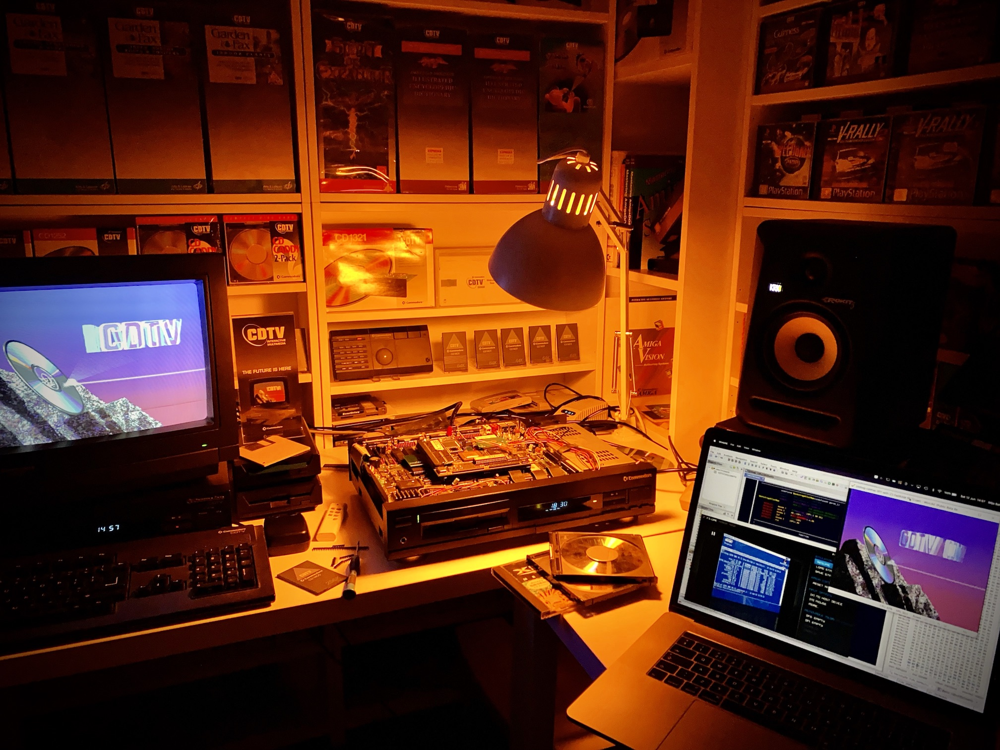

# CDTV OS 2.35 patch

This repository contains a patch that can convert an official Commodore CDTV 2.30 Extended ROM image into a 2.35 ROM image. For copyright reasons you need to supply the 2.30 ROM image yourself.

_This repository contains no Commodore/Amiga intellectual property._

## What is CDTV OS 2.35?
CDTV OS 2.35 is an _unofficial_ update to the Commodore CDTV Operating System ROM. It is the first major update to the ROM since 1992. It fixes numerous bugs, increases compatibility with 68030 accelerators and adds some quality-of-life improvements. For a features/fixes rundown see the CDTV OS 2.35 information page on [CDTV Land](https://cdtvland.com/os235). For more technical details please consult the [CDTV OS 2.35 FAQ](README-faq.md).

## How to apply the patch

### Using Docker image

Requirements:

- Intel based macOS or Linux operating system
- Make
- Docker
- The official CDTV 2.30 Extended ROM image (md5 sum: d98112f18792ee3714df16a6eb421b89)

Steps:

- Place the official 2.30 ROM in the root of this project directory
- Rename it to `230.rom`
- Run the following command

```sh
make cdtvos235rom
```

You can also run the docker command directly if you prefer:

```sh
docker run --rm -v $(pwd):/data captainfuture/cdtvos235patch:1.0.0 /appl/run.sh
```

If the patch was succesful, you will end up with a new ROM image for 2.35 in the current directory.

### Building the Docker image yourself
The Dockerfile is included in this repo, so instead of pulling the Docker image you can build it yourself if you'd prefer so. 


## Tools used to create CDTV OS 2.35



- My brain
- MacBook Pro
- A networked A500 to copy ROM images from network to floppy disk
- CDTV Developer "Flash Memory" Board
- Several CDTV (CD-1000) players
- Viper 530 accelerator board
- TF536 accelerator board
- Visual Studio Code
- Ghidra 9.1.2 (to reverse engineer resident modules)
- Some regex-fu to make the Ghidra ASM exports actually build
- vasm
- ROMSplit and amitools
- Commodore Amiga Native ROM Build Tools (DoBuild)
- WinUAE (running in Parallels Desktop VM)
- Coffee
- Alcohol

More info in the [CDTV OS 2.35 FAQ](README-faq.md).