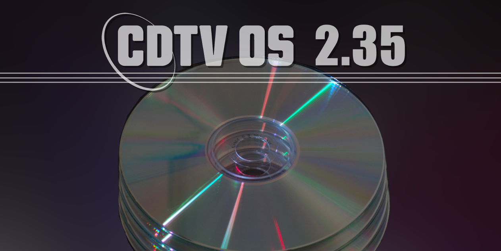
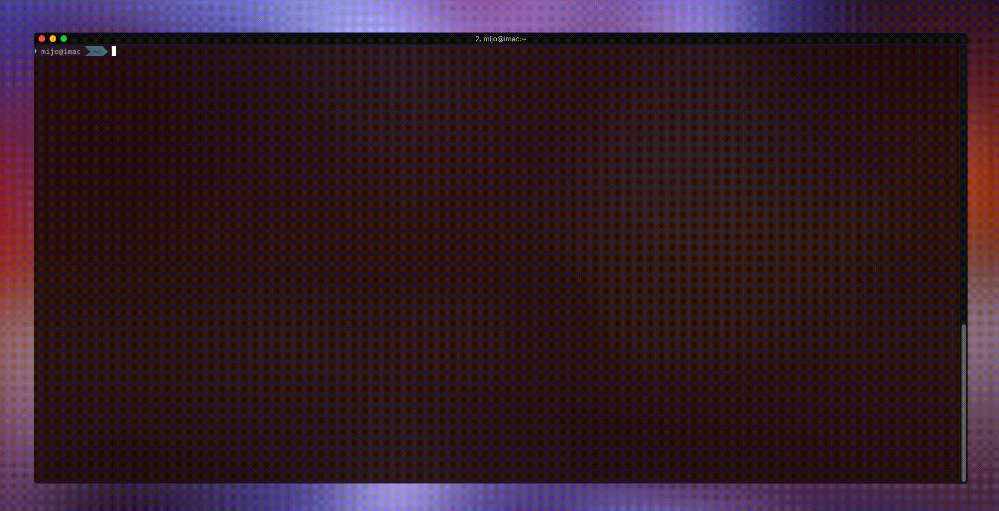

# CDTV OS 2.35 patch

This repository contains a patch that can convert an official Commodore CDTV 2.30 Extended ROM image into a 2.35 ROM image. For copyright reasons you need to supply the 2.30 ROM image yourself.

_This repository contains no Commodore/Amiga intellectual property._



# Table of Contents


<!-- vscode-markdown-toc -->
* 1. [What is CDTV OS 2.35?](#WhatisCDTVOS2.35)
* 2. [Important Notes](#ImportantNotes)
* 3. [How to apply the patch](#Howtoapplythepatch)
	* 3.1. [Using Docker image](#UsingDockerimage)
	* 3.2. [Building the Docker image yourself](#BuildingtheDockerimageyourself)
	* 3.3. [Using bspatch directly](#Usingbspatchdirectly)
* 4. [Version History](#VersionHistory)
* 5. [Tools used to create CDTV OS 2.35](#ToolsusedtocreateCDTVOS2.35)

<!-- vscode-markdown-toc-config
	numbering=true
	autoSave=true
	/vscode-markdown-toc-config -->
<!-- /vscode-markdown-toc -->


##  1. <a name='WhatisCDTVOS2.35'></a>What is CDTV OS 2.35?
CDTV OS 2.35 is an _unofficial_ update to the Commodore CDTV Operating System ROM. It is the first major update to the ROM since 1992. The 2.35 update does the following things:

- It restores all functionality to the CDTV player that was lost in the 2.0, 2.7 and 2.30 updates.
- It adds compatibility with 68030 accelerators and 32-bit-Fast RAM
- It adds some quality of life features and fixes some bugs.

CDTV OS 2.35 is available for the CD1000 (CDTV player), A570 and A690 CD-ROM drives in traditional ROM format. It is also available as a special image that can be loaded onto a CDTV memory card (models CD1401, CD1405), although this is currently an experimental implementation.

For a more detailed rundown of all the changes see the CDTV OS 2.35 information page on [CDTV Land](https://cdtvland.com/os235). For more technical details please consult the [CDTV OS 2.35 FAQ](README-faq.md).


##  2. <a name='ImportantNotes'></a>Important Notes
- If you plan to use the ***TF536*** accelerator board with your CDTV player or A570/A690, please make sure you ***update your TF536*** to the latest [TF536 firmware for CDTV](https://exxosforum.co.uk/forum/viewtopic.php?f=76&t=5920). See the [CDTV OS 2.35 FAQ](README-faq.md) for more information.

- If you plan to use your A570 with a 68030 accelerator board, make sure you ***remove or disable the A570's internal 2MB memory expansion*** if you have one. Tests have shown that a 68030 with Z3 Fast RAM in conjunction with the A570's internal 2MB Fast RAM results in an unstable system, with apparently random crashes/gurus.


##  3. <a name='Howtoapplythepatch'></a>How to apply the patch

###  3.1. <a name='UsingDockerimage'></a>Using Docker image

Requirements:

- Intel based macOS or Linux operating system
- Make
- Docker
- The official CDTV 2.30 Extended ROM image (md5 sum: d98112f18792ee3714df16a6eb421b89)

Steps:

- Place the official 2.30 ROM in the root of this project directory
- Rename it to `230.rom`
- Run the following command

```sh
make cdtvos235rom
```

You can also run the docker command directly if you prefer:

```sh
docker run --rm -v $(pwd):/data captainfuture/cdtvos235patch:1.0.3 /appl/run.sh
```

If the patch was succesful, you will end up with several new files in the current directory:

| Filename                                                     | Description                                                                                                            |
|--------------------------------------------------------------|------------------------------------------------------------------------------------------------------------------------|
|`CDTV Extended-ROM v2.35 (2021)(CDTV Land)(CDTV).rom`         | This is the CD1000 (CDTV player) 2.35 ROM image you can use in emulators                                               |
|`CDTV_v2_35_U34_Even.bin`                                     | This is the CD1000 (CDTV player) split "even" binary of the 2.35 ROM image that you can use to burn to an 27c100 EPROM |
|`CDTV_v2_35_U35_Odd.bin`                                      | This is the CD1000 (CDTV player) split "odd" binary of the 2.35 ROM image that you can use to burn to an 27c100 EPROM  |
|`CDTV Extended-ROM v2.35 (2022)(CDTV Land)(A570).rom`         | This is the A570 CD-ROM drive 2.35 ROM image you can use in emulators                                                  |
|`A570_v2_35.bin`                                              | This is the A570 CD-ROM drive 2.35 byteswapped ROM image you can use to burn to a 27c400 EPROM                         |
|`CDTV Extended-ROM v2.35 (2022)(CDTV Land)(A690).rom`         | This is the A690 CD-ROM drive 2.35 ROM image you can use in emulators                                                  |
|`A690_v2_35.bin`                                              | This is the A690 CD-ROM drive 2.35 byteswapped ROM image you can use to burn to a 27c400 EPROM                         |
|`CDTV Extended-ROM v2.35 (2023)(CDTV Land)(CD1401-CD1405).rom`| This is the 2.35 ROM image you can install on CDTV memory cards (CD1401 or CD1405)                                     |
|`CDTVOS235-memcard-installer.adf`                             | This is a bootable floppy image that installs the 2.35 ROM image on a CDTV memory card                                 |
|`CDTVOS235-memcard-installer.iso`                             | This is a bootable CD-ROM image that installs the 2.35 ROM image on a CDTV memory card                                 |




###  3.2. <a name='BuildingtheDockerimageyourself'></a>Building the Docker image yourself
The Dockerfile is included in this repo, so instead of pulling the Docker image you can build it yourself if you'd prefer so. 


###  3.3. <a name='Usingbspatchdirectly'></a>Using bspatch directly
The patch has been created using bsdiff. If you have bsdiff/bspatch on your UNIX/Linux/macOS system you can also apply the patch manually without the overhead of Docker and make.

Once you have bspatch you only need the `235-release-<device name>-patch.bin` patch file from the `src/docker` directory. You can then apply the patch as follows:

```sh
bspatch 230.rom "CDTV Extended-ROM v2.35 (2021)(CDTV Land)(CDTV).rom" 235-release-cd1000-patch.bin
bspatch 230.rom "CDTV Extended-ROM v2.35 (2022)(CDTV Land)(A570).rom" 235-release-a570-patch.bin
bspatch 230.rom "CDTV Extended-ROM v2.35 (2022)(CDTV Land)(A690).rom" 235-release-a690-patch.bin
```
This should generate the 2.35 ROM images for CD1000, A570 and A690 respectively.

The CD1401/CD1405 image can be generated by patching the newly generated CD1000 2.35 with the cd1401 patch .bin file and then truncating it to 64K: `truncate -s 65536 "${CDTV235ROM_MEMCARD}"`

##  4. <a name='VersionHistory'></a>Version History

- _1.0.0_: First release
- _1.0.1_: Add support for splitting ROM image in even and odd
- _1.0.2_: Add creation of 2.35/A570 and 2.35/A690 ROM images
- _1.0.3_: Add creation of 2.35/CD1401/CD1405 ROM images (for CDTV memory cards)

##  5. <a name='ToolsusedtocreateCDTVOS2.35'></a>Tools used to create CDTV OS 2.35


- My brain
- MacBook Pro
- A networked A500 to copy ROM images from network to floppy disk
- CDTV Developer "Flash Memory" Board
- Several CDTV (CD-1000) players
- Viper 530 accelerator board
- TF536 accelerator board
- Visual Studio Code
- Ghidra 9.1.2 (to reverse engineer resident modules)
- Some regex-fu to make the Ghidra ASM exports actually build
- vasm
- ROMSplit and amitools
- Commodore Amiga Native ROM Build Tools (DoBuild)
- WinUAE (running in Parallels Desktop VM)
- Coffee
- Alcohol

More info in the [CDTV OS 2.35 FAQ](README-faq.md).